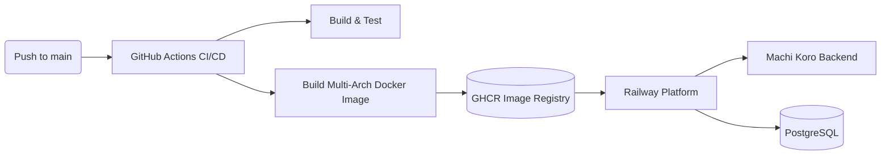

# Backend Container Deployment

This document covers the current backend container build and deployment path
for **Railway**, a cloud platform that runs Docker containers and manages PostgreSQL databases automatically. The production backend automatically pulls the latest image from the GitHub Container Registry (GHCR) on every push to `main`.

It is based on the `SE2-Machi-Koro/Server` repository files:

- `Dockerfile`
- `railway.toml`
- `compose.yaml`
- `compose-dev.yaml`
- `.github/workflows/docker-publish.yml`
- `.env.example`
- `src/main/resources/application.properties`

## Production Endpoints (Railway)

The backend is served on the Railway HTTPS domain `machi-koro.up.railway.app`.

| Resource | URL |
| :--- | :--- |
| Backend HTTP | `https://machi-koro.up.railway.app` |
| Health (aggregate) | `https://machi-koro.up.railway.app/actuator/health` |
| Readiness probe (Railway deploy gate) | `https://machi-koro.up.railway.app/actuator/health/readiness` |
| Liveness probe | `https://machi-koro.up.railway.app/actuator/health/liveness` |
| WebSocket | `wss://machi-koro.up.railway.app/ws` |
| Swagger UI | `https://machi-koro.up.railway.app/swagger-ui.html` |
| AsyncAPI UI | `https://machi-koro.up.railway.app/springwolf/asyncapi-ui.html` |

Expected health response:

```json
{
  "status": "UP"
}
```

All three health endpoints return `{"status": "UP"}` for unauthenticated callers.
Railway's deploy health check targets the **readiness** probe
(`/actuator/health/readiness`), which is DB-aware — see
[Reliability and Health Checks](#reliability-and-health-checks).

> **Note:** Previously deployed to the AAU shared infrastructure (`se2-demo.aau.at`, group 6) via [doco-cd](https://github.com/kimdre/doco-cd). See [Legacy AAU Deployment](#legacy-aau-deployment) for historical reference.

## Railway Deployment Pipeline



1. A push to `main` triggers the [`Publish Docker image to GHCR`](.github/workflows/docker-publish.yml) workflow.
2. The workflow first runs a `build-jar` job on `ubuntu-latest`, sets up JDK 21 with Gradle dependency caching, and executes `./gradlew bootJar -x test` exactly once. The resulting application jar is uploaded as a short-lived workflow artifact.
3. The `build-and-push` job downloads that artifact and uses Docker Buildx to package and push the multi-architecture runtime image for `linux/amd64` and `linux/arm64` without recompiling the application per architecture.
4. The published image is pushed to `ghcr.io/se2-machi-koro/server` with the tags:
   - `latest` (only on `main`)
   - `sha-<short-commit>` (every build, used for rollback)
   - `v*` (when a Git tag matching `v*` is pushed)
5. Railway detects the new image (via pull_policy: always) and automatically redeploys the backend service.
6. The PostgreSQL database and backend run together in Railway; the backend is published on Railway's auto-generated HTTPS domain.

### Setting up Railway (First Time)

1. Go to [railway.app](https://railway.app) and sign up with your GitHub account.
2. Create a new project.
3. Add a PostgreSQL database to the project (Railway provides automatic hosting and backup).
4. Create an empty service and deploy from Docker image: `ghcr.io/se2-machi-koro/server:latest`
5. In the backend service settings, configure the following environment variables:
   ```
   DB_HOST=${{Postgres.PGHOST}}
   DB_PORT=${{Postgres.PGPORT}}
   DB_NAME=${{Postgres.PGDATABASE}}
   DB_USERNAME=${{Postgres.PGUSER}}
   DB_PASSWORD=${{Postgres.PGPASSWORD}}
   SERVER_PORT=8080
   SPRING_DOCKER_COMPOSE_ENABLED=false
   WEBSOCKET_ALLOWED_ORIGINS=https://machi-koro.up.railway.app
   DEBUG_ENABLED=false
   ADMIN_PASSWORD=
   ```
6. Generate a public domain in the networking settings (this project uses `machi-koro.up.railway.app`) and set `WEBSOCKET_ALLOWED_ORIGINS` to that domain.
7. The backend is now live and will auto-update on every push to `main`.

## Reliability and Health Checks

The backend is configured for resilient operation on Railway (redeploys, transient
database blips, and managed-Postgres connection drops). The relevant settings live
in `railway.toml` and `src/main/resources/application.properties`.

### Railway service config (`railway.toml`)

`railway.toml` pins the Railway deploy behaviour in the repository rather than
only in the dashboard. The key settings are:

```toml
[build]
builder = "DOCKERFILE"
dockerfilePath = "/Dockerfile"

[deploy]
numReplicas = 1
healthcheckPath = "/actuator/health/readiness"
restartPolicyType = "ON_FAILURE"
restartPolicyMaxRetries = 10
```

- **`healthcheckPath = "/actuator/health/readiness"`** — after starting a new
  container, Railway polls this path and only switches production traffic to it
  once it returns `200`. Because the readiness probe is **DB-aware** (see below),
  a new deployment is gated until the database is actually reachable. This is the
  Railway deploy gate — **not** the plain aggregate `/actuator/health` endpoint.
- **`restartPolicyType = "ON_FAILURE"` / `restartPolicyMaxRetries = 10`** —
  Railway restarts a container that exits with a failure, up to 10 times before
  giving up.

### Readiness vs. liveness probes

Spring Boot's availability probes are enabled and the readiness group is extended
to include the database, so the two failure modes are handled differently:

```properties
management.endpoint.health.probes.enabled=true
management.endpoint.health.group.readiness.include=readinessState,db
management.endpoint.health.validate-group-membership=false
```

| Endpoint | Includes DB? | Used for |
| :--- | :--- | :--- |
| `/actuator/health` | Yes (full aggregate) | Overall status; the `compose.yaml` container healthcheck. |
| `/actuator/health/readiness` | **Yes** | Railway deploy gate — "can this instance serve traffic?" |
| `/actuator/health/liveness` | No | "Is the process alive?" — whether the container should be restarted. |

The **readiness** group includes the `db` contributor, so the instance reports
"not ready" (and Railway holds traffic) whenever the database is unreachable. The
**liveness** group deliberately **excludes** the database, so a transient DB blip
does **not** trigger a container restart — the process stays up and recovers once
the DB returns.

> `management.endpoint.health.validate-group-membership=false` keeps application
> startup from failing in contexts that run without a datasource (e.g. some
> tests), where the `db` contributor referenced by the readiness group is absent.

### Graceful shutdown

On redeploy, Railway sends `SIGTERM` to the old container. The backend shuts down
gracefully instead of dropping connections mid-flight:

```properties
server.shutdown=graceful
spring.lifecycle.timeout-per-shutdown-phase=30s
```

In-flight HTTP requests are allowed to finish and WebSocket sessions close
cleanly, with a 30-second drain window before the process exits.

### Database connection resilience

The Hikari connection pool is tuned so connections are retired and validated
before a managed Postgres (or proxy) silently drops them:

```properties
spring.datasource.hikari.max-lifetime=600000
spring.datasource.hikari.keepalive-time=300000
spring.datasource.hikari.connection-timeout=30000
spring.datasource.hikari.validation-timeout=5000
```

- **`max-lifetime` (10 min)** — retire a connection before typical managed-DB
  idle timeouts close it server-side.
- **`keepalive-time` (5 min)** — periodically validate idle connections; must be
  shorter than `max-lifetime`.
- **`connection-timeout` (30 s)** / **`validation-timeout` (5 s)** — bound how
  long the pool waits to hand out a new or freshly validated connection.

## Dockerfile Build Path

The backend `Dockerfile` supports two build paths:

| Target | Purpose |
| :--- | :--- |
| `runtime-from-builder` | Source-based build path. The Docker build runs `./gradlew bootJar -x test` inside the builder stage. |
| `runtime-from-workspace` | CI publish path. The GitHub workflow builds the jar first, copies it to `build/docker/app.jar`, and Docker packages that jar. |

The final default target is `final`, which currently resolves to
`runtime-from-builder`. The GHCR workflow explicitly uses
`target: runtime-from-workspace` to avoid rebuilding the jar once per Docker
architecture.

Manual local image build from the backend repository:

```bash
docker build -t machikoro-server:local .
```

### Dockerfile Requirements for Railway

Railway's BuildKit requires explicit `id` parameters for Docker cache mounts. The `--mount=type=cache` directive in the Dockerfile must include an `id` parameter:

```dockerfile
RUN --mount=type=cache,id=gradle,target=/root/.gradle \
    ./gradlew bootJar -x test
```

Without the `id`, Railway's build will fail with: `"--mount=type=cache requires an explicit id parameter"`. This is automatically handled in the current Dockerfile.

## Compose Files

### `compose.yaml`

`compose.yaml` is the production stack definition. It runs:

- `postgres`, using `postgres:18.0`;
- `backend`, using `ghcr.io/se2-machi-koro/server:${IMAGE_TAG:-latest}`.

The backend service:

- publishes `${PUBLIC_PORT:-53210}:8080`;
- sets `SERVER_PORT=8080` inside the container;
- connects to Postgres through the internal Compose network with
  `DB_HOST=postgres` and `DB_PORT=5432`;
- disables Spring Boot Docker Compose integration with
  `SPRING_DOCKER_COMPOSE_ENABLED=false`;
- defaults `WEBSOCKET_ALLOWED_ORIGINS` to the public AAU origins
  (`http://se2-demo.aau.at:53210,https://se2-demo.aau.at:53210`);
- keeps the debug admin-seeding switches off by default
  (`DEBUG_ENABLED=false`, empty `ADMIN_PASSWORD`);
- bounds the JVM heap to the container limit with
  `JAVA_TOOL_OPTIONS=-XX:MaxRAMPercentage=75.0`;
- pulls the image on refresh through `pull_policy: always`;
- restarts automatically with `restart: unless-stopped`;
- exposes a container health check at
  `http://localhost:8080/actuator/health` (the aggregate endpoint — Railway
  instead gates deploys on the DB-aware readiness probe; see
  [Reliability and Health Checks](#reliability-and-health-checks)).

Both services declare CPU and memory limits under `deploy.resources` (the
backend is capped at 1 CPU / 512 MB, Postgres at 0.5 CPU / 256 MB) so
the stack stays within the shared-server quota.

The Postgres service is not exposed on the production host. It is only reachable
inside the Compose network.

### `compose-dev.yaml`

`compose-dev.yaml` is for local development. It starts Postgres and pgAdmin, and
the backend can then run from source with Gradle.

Local development startup from the backend repository:

```bash
cp .env.example .env
docker compose -f compose-dev.yaml --env-file .env up -d postgres
./gradlew bootRun
```

The old docs command using `compose.local-test.yaml` is outdated for the current
backend repository because the current Compose files are `compose.yaml` and
`compose-dev.yaml`.

## GHCR Publishing and Automatic Railway Deployment

The GitHub Actions workflow `.github/workflows/docker-publish.yml` builds the
backend image and publishes it to GHCR. Railway automatically detects the new image and redeploys. The image
is published to:

```text
ghcr.io/se2-machi-koro/server
```

Triggers:

- push to `main`;
- git tags matching `v*`;
- manual `workflow_dispatch`.

The workflow runs two sequential jobs:

1. **`build-jar`** checks out the backend repository, sets up JDK 21, and runs:

```bash
./gradlew bootJar -x test
mkdir -p build/docker
cp build/libs/*.jar build/docker/app.jar
```

   The jar is uploaded as a short-lived artifact named `app-jar`.

2. **`build-and-push`** downloads the jar, sets up QEMU and Docker Buildx, logs
   in to GHCR using `GITHUB_TOKEN`, and builds and pushes the Docker image with:

```text
target: runtime-from-workspace
platforms: linux/amd64,linux/arm64
```

Published tags:

| Tag | Meaning |
| :--- | :--- |
| `latest` | Published for `main`. Railway automatically pulls this on update. |
| `sha-<short-commit>` | Published for each workflow run and used for rollback. |
| `v*` | Published when a matching version tag is pushed. |
| branch ref tag | Produced by Docker metadata for branch builds. |

The build-and-push job needs no custom GHCR secret: it uses GitHub's built-in
`GITHUB_TOKEN` with `packages: write` permission.

## Automatic Railway Deployment

Deployment to Railway is fully automated. The end-to-end path is:

1. Merge or push the backend change to `main`.
2. GitHub Actions builds the jar and publishes a new GHCR image
   (`latest` and `sha-<short-commit>`).
3. Railway detects the updated `latest` image tag (via `pull_policy: always`) and automatically redeploys the backend service.
4. The backend service pulls the new image and restarts; PostgreSQL is left untouched.
5. Railway gates the new deployment on its configured health check —
   `GET /actuator/health/readiness` (the DB-aware readiness probe; see
   [Reliability and Health Checks](#reliability-and-health-checks)) — and only
   switches production traffic to the new container once it returns `UP`.

Verify the public service on your Railway domain:

```bash
# Aggregate health (overall status)
curl -s https://machi-koro.up.railway.app/actuator/health
# Readiness probe — the path Railway gates deploys on
curl -s https://machi-koro.up.railway.app/actuator/health/readiness
```

Expected response (either endpoint):

```json
{"status":"UP"}
```

## Railway Rollback

To roll back to a previous published image:

1. In the Railway dashboard, go to your backend service settings.
2. Locate the `IMAGE_TAG` environment variable (or create it if it doesn't exist).
3. Set it to a known-good `sha-<short-commit>` tag from GHCR or the GitHub Actions run.
4. Save the changes. Railway will automatically redeploy with the specified image tag.
5. Verify the deployment:

```bash
curl -s https://machi-koro.up.railway.app/actuator/health
```

For example, to roll back to a specific commit:

```
IMAGE_TAG=sha-abc1234
```

## Legacy AAU Deployment

Previously, the server was deployed to the AAU shared infrastructure via doco-cd. This section is kept for historical reference.

### AAU Server Access (Legacy)

```bash
ssh grp-6@se2-demo.aau.at -p 53200
```

The doco-cd working copy of this repo lives at:

```
/var/lib/docker/volumes/doco-cd-setup_data/_data/github.com/SE2-Machi-Koro/Server/
```

### AAU Manual Deployment (Legacy)

Use this when the automated deploy is unavailable or when a manual refresh is needed.

Prepare the deployment directory if it does not already exist:

```bash
mkdir -p /home/grp-6/machi-koro-server-deploy
cp compose.yaml /home/grp-6/machi-koro-server-deploy/compose.yaml
cd /home/grp-6/machi-koro-server-deploy
```

Create or update the production `.env` next to `compose.yaml` and restrict its permissions:

```bash
chmod 600 .env
```

Minimal production `.env`:

```env
DB_NAME=machikoro
DB_USERNAME=machikoro
DB_PASSWORD=<production-password>
PUBLIC_PORT=53210
WEBSOCKET_ALLOWED_ORIGINS=http://se2-demo.aau.at:53210,https://se2-demo.aau.at:53210
IMAGE_TAG=latest
```

Start or refresh the stack:

```bash
docker compose pull
docker compose up -d
docker compose ps
```

Expected result:

```text
machikoro-db       healthy
machikoro-server   healthy
```

Confirm the public health endpoint:

```bash
curl -s http://se2-demo.aau.at:53210/actuator/health
```

### AAU Live Endpoints (Legacy - No Longer Active)

| Resource | URL |
| :--- | :--- |
| Backend | `http://se2-demo.aau.at:53210` |
| Health check | `http://se2-demo.aau.at:53210/actuator/health` |
| WebSocket | `ws://se2-demo.aau.at:53210/ws` |
| Swagger UI | `http://se2-demo.aau.at:53210/swagger-ui.html` |

### AAU Rollback (Legacy)

To roll back to a previous image, edit the production `.env` on the server and set `IMAGE_TAG=sha-<short-commit>` (or any other tag published to GHCR), then trigger a manual `docker compose up -d` or a doco-cd reconcile. The `compose.yaml` resolves the image as `ghcr.io/se2-machi-koro/server:${IMAGE_TAG:-latest}`.

## Required Environment Variables

| Variable | Required in production | Description |
| :--- | :--- | :--- |
| `DB_NAME` | Yes | PostgreSQL database name. |
| `DB_USERNAME` | Yes | PostgreSQL database user. |
| `DB_PASSWORD` | Yes | PostgreSQL password. Must never be committed. On Railway, reference `${{Postgres.PGPASSWORD}}`. |
| `WEBSOCKET_ALLOWED_ORIGINS` | Yes | Comma-separated allowed browser/client origins. On Railway, set to the generated public domain. |
| `SERVER_PORT` | Yes (Railway) | Container server port. Set to `8080` on Railway. |
| `SPRING_DOCKER_COMPOSE_ENABLED` | Yes (Railway) | Set to `false` on Railway so Spring does not try to manage Compose. |
| `DB_HOST` | Yes (Railway) | Database hostname. On Railway, reference `${{Postgres.PGHOST}}`. |
| `DB_PORT` | Yes (Railway) | Database port. On Railway, reference `${{Postgres.PGPORT}}`. |
| `IMAGE_TAG` | No | GHCR tag to deploy. Defaults to `latest`; set to `sha-<short-commit>` for rollback. |
| `DEBUG_ENABLED` | No | Enables debug endpoints and admin-account seeding. Defaults to `false`; keep off in production. |
| `ADMIN_PASSWORD` | No | Password for the seeded admin accounts. Required only when `DEBUG_ENABLED=true`. Must never be committed. |
| `PUBLIC_PORT` | Legacy (AAU only) | Host port assigned by AAU. Group 6 used `53210`. Not used on Railway. |

On Railway, the database variables are typically wired to the managed PostgreSQL service using reference syntax:

```
DB_HOST=${{Postgres.PGHOST}}
DB_PORT=${{Postgres.PGPORT}}
DB_NAME=${{Postgres.PGDATABASE}}
DB_USERNAME=${{Postgres.PGUSER}}
DB_PASSWORD=${{Postgres.PGPASSWORD}}
```

Local-only variables for `compose-dev.yaml`:

| Variable | Description |
| :--- | :--- |
| `PGADMIN_EMAIL` | pgAdmin login email for local development. |
| `PGADMIN_PASSWORD` | pgAdmin login password for local development. |

## Rollback

For release tagging conventions and how production releases are promoted, see
[Backend-Release-Management.md](Backend-Release-Management.md). For the rollback
procedure on Railway, see [Railway Rollback](#railway-rollback) above; for the
legacy AAU procedure, see [AAU Rollback (Legacy)](#aau-rollback-legacy).

## Verification Checklist

- `Dockerfile` has both source-build and CI-packaged-jar paths.
- `Dockerfile` cache mounts include explicit `id` parameters (required by Railway BuildKit).
- `compose.yaml` uses the GHCR image and publishes `${PUBLIC_PORT:-53210}:8080`.
- `compose.yaml` health checks `http://localhost:8080/actuator/health` (the
  aggregate endpoint, intentionally — not the readiness probe).
- `compose-dev.yaml` is documented as local-only.
- GHCR publish workflow targets `runtime-from-workspace`.
- Railway environment variables (DB references, `SERVER_PORT`, `WEBSOCKET_ALLOWED_ORIGINS`) are documented.
- Railway's health check (`railway.toml` `healthcheckPath`) is documented as the
  DB-aware readiness probe `/actuator/health/readiness`.
- Readiness (DB-aware) vs. liveness (no-DB) probe split is documented.
- Graceful shutdown (`server.shutdown=graceful`, 30 s drain) is documented.
- Hikari DB-resilience settings (`max-lifetime`, `keepalive-time`, validation
  timeouts) are documented.
- `railway.toml` (builder, `healthcheckPath`, restart policy) is documented.
- Railway WebSocket URL is documented as `wss://machi-koro.up.railway.app/ws`.
- Automatic Railway deployment via GHCR image updates is documented.
- Railway rollback and the legacy AAU deployment path are documented separately.
- Admin-seeding switches (`DEBUG_ENABLED`, `ADMIN_PASSWORD`) are documented and
  default to off.
- Required production secrets are listed and are not committed.

